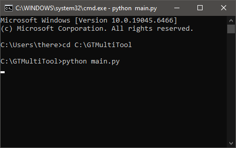
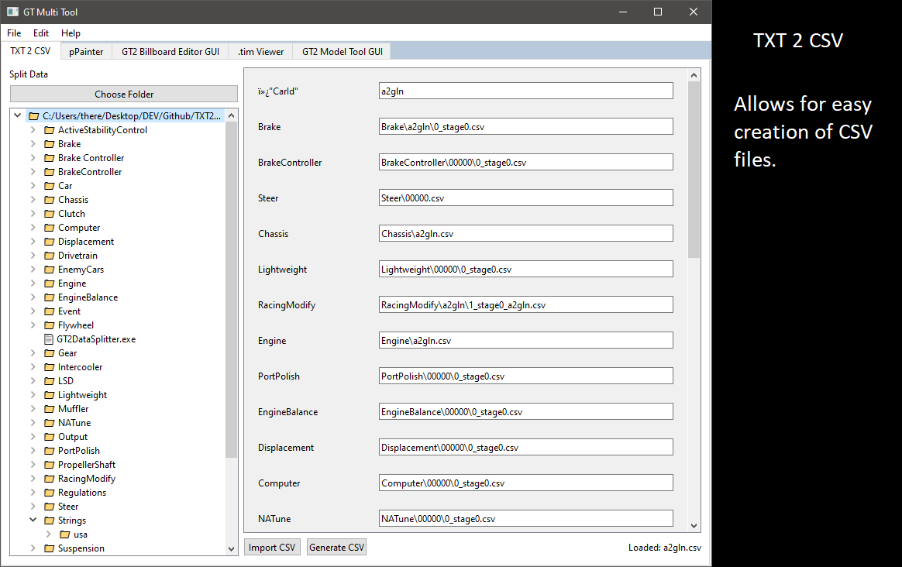
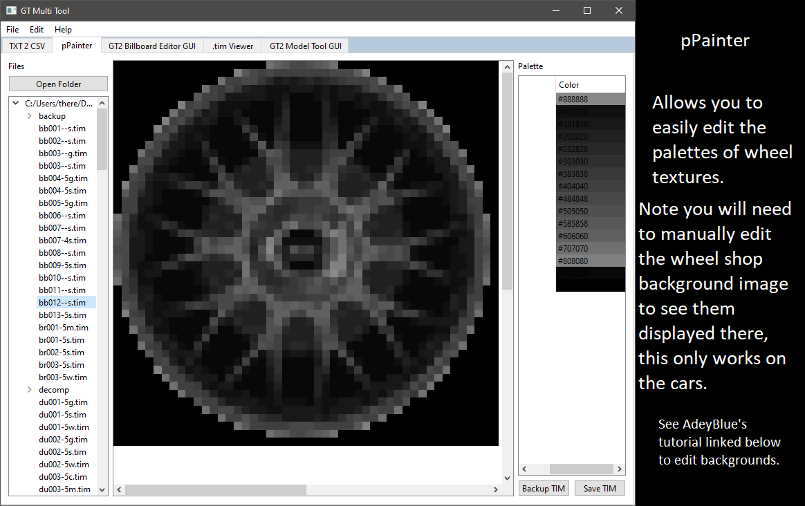
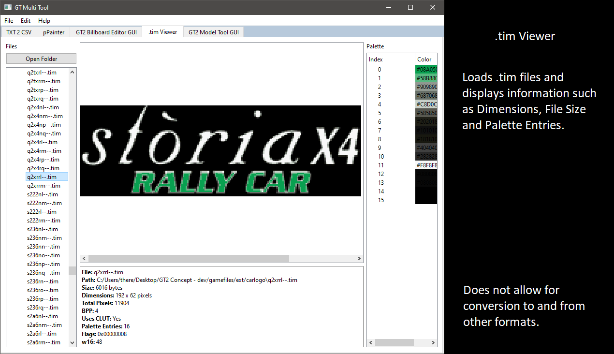

# GT Multi Tool

GT Multi Tool is a GUI that features some useful tools and acts as a wrapper for:

- GT2ModelTool  
- GT2TextureTool  
- GT2BillboardEditor  

## How to run

1. Download or clone the repository  
2. Place the `GTMultiTool` folder on the `C:` drive  
3. Open Command Prompt  
4. Run:
cd C:\GTMultiTool
python main.py

## Screenshots

## Credit

- Freepik: Icons